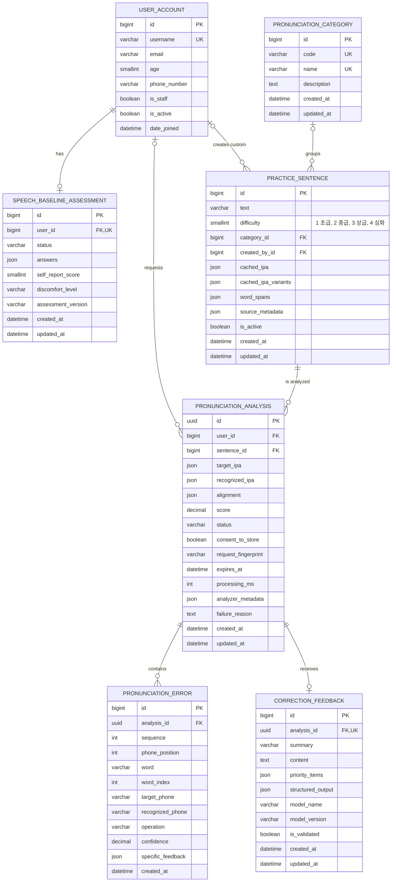

# Jipangi Database ERD

보고서에서는 Django 내부 인증/세션 테이블보다 서비스의 핵심 흐름이 잘 보이는 것이 중요하므로, 아래 ERD는 `사용자 → 연습 항목 → 발음 분석 → 오류/피드백` 도메인 테이블 중심으로 정리했다.

이미지 파일:

- [보고서용 PNG](./database-erd-report.png)
- [벡터 SVG](./database-erd-report.svg)

## 관계 요약

| 관계 | 카디널리티 | 의미 |
|---|---:|---|
| `user_account` → `speech_baseline_assessment` | `1 : 0..1` | 회원가입/온보딩 후 초기 발음 자가평가를 한 번 저장 |
| `user_account` → `practice_sentence` | `0..1 : N` | `created_by_id`가 비어 있으면 기본 문장, 값이 있으면 사용자 생성 문장 |
| `pronunciation_category` → `practice_sentence` | `0..1 : N` | 생활 카테고리 또는 발음 규칙별 문장 분류 |
| `user_account` → `pronunciation_analysis` | `0..1 : N` | 로그인 사용자 분석 이력. 사용자 삭제 시 분석의 `user_id`는 `NULL` |
| `practice_sentence` → `pronunciation_analysis` | `1 : N` | 하나의 연습 항목은 여러 분석 이력을 가질 수 있음 |
| `pronunciation_analysis` → `pronunciation_error` | `1 : N` | 분석 결과에서 검출된 발음 오류 목록 |
| `pronunciation_analysis` → `correction_feedback` | `1 : 0..1` | 분석 1건당 LLM 기반 교정 피드백 최대 1개 |

## 보고서에서 강조할 구조

- `PracticeSentence`는 난이도(`초급/중급/상급/심화`)와 카테고리(`생활 상황`, `연음화`, `비음화` 등)를 함께 가진다.
- `cached_ipa_variants`에 다중 정답 IPA 후보를 저장해, 한국어 발음 규칙과 허용 발음 차이를 평가에 반영한다.
- `PronunciationAnalysis`는 사용자 음성을 Allosaurus 기반 IPA로 변환하고, 목표 IPA와 정렬한 뒤 점수를 저장한다.
- `PronunciationError`는 오류 단위를 분리해 자주 틀리는 음소/규칙 통계를 만들 수 있게 한다.
- `CorrectionFeedback`은 분석 결과에 대한 LLM 피드백을 별도 테이블로 분리해 재분석 없이 조회할 수 있게 한다.

## 주요 제약조건/인덱스

- `practice_sentence.difficulty`: `1`, `2`, `3`, `4`만 허용
- `pronunciation_analysis.status`: `pending`, `processing`, `completed`, `failed`
- `pronunciation_analysis.score`: `NULL` 또는 `0.0 ~ 100.0`
- `pronunciation_error.confidence`: `NULL` 또는 `0.0 ~ 1.0`
- `pronunciation_error`: `(analysis_id, sequence)` 고유
- `practice_sentence`: `(created_by, text)` 고유
- 주요 조회 인덱스:
  - `practice_sentence`: `(is_active, difficulty)`, `(category, is_active)`, `(created_by, is_active)`
  - `pronunciation_analysis`: `(user, created_at)`, `(sentence, created_at)`, `(status, created_at)`, `request_fingerprint`, `expires_at`
  - `pronunciation_error`: `(analysis, operation)`, `(target_phone, recognized_phone)`

## 제외한 테이블

보고서용 ERD에서는 아래 Django 내부 테이블을 제외했다.

- `auth_group`, `auth_permission`
- `user_account_groups`, `user_account_user_permissions`
- `django_admin_log`, `django_session`, `django_content_type`
- JWT blacklist 관련 테이블

필요하면 부록용으로 전체 Django auth 테이블까지 포함한 “전체 물리 ERD”를 따로 만들 수 있다.
