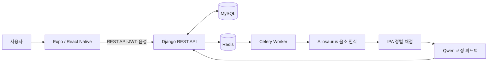

# Jipangi

> 청각장애인을 위한 IPA 기반 한국어 발음 연습·교정 서비스

Jipangi는 사용자의 음성을 한국어 음소열로 인식하고, 목표 IPA와 비교해 발음 점수와 오류 위치, 교정 피드백을 제공하는 부산대학교 컴퓨터공학과 졸업과제입니다. Expo 클라이언트, Django API, 비동기 분석 작업, KsponSpeech로 파인튜닝한 Allosaurus 음소 인식기와 LLM 피드백 서비스를 한 저장소에서 관리합니다.

> [!IMPORTANT]
> 본 프로젝트는 연구·교육용 프로토타입입니다. 분석 결과는 의료적 진단이나 전문가의 임상적 판단을 대체하지 않습니다.

## 핵심 기능

- 이메일 기반 회원가입·로그인과 JWT Access/Refresh 토큰 교체
- 카테고리·난이도별 한국어 발음 연습 문장 제공
- Expo/React Native의 음성 녹음, 업로드와 비동기 분석 상태 조회
- 34개 한국어 음소를 대상으로 파인튜닝한 Allosaurus 음소 인식
- 복수의 허용 발음 변이를 고려한 IPA 정렬, 삽입·삭제·치환 오류와 점수 계산
- Qwen 기반 요약·우선 연습 항목·음소별 교정 피드백
- 사용자별 기록, 통계, 취약 음소와 추천 문장 조회
- 저장 미동의 결과의 30분 후 삭제와 분석 후 원본 음성 삭제

## 시스템 구성



음성 분석은 API 응답과 분리된 Celery 작업으로 실행됩니다. Qwen 서비스가 일시적으로 사용 불가능하더라도 음향 분석 결과를 잃지 않도록 규칙 기반 대체 피드백을 저장합니다.

## 저장소 구조

```text
.
├── Jipangi/
│   ├── frontend/          # Expo / React Native 클라이언트
│   ├── backend/           # Django REST API, Celery, 데이터 모델
│   ├── ai_services/       # Allosaurus·Qwen 추론 서비스 실행 도구
│   ├── docs/              # API 명세, OpenAPI, ERD
│   └── tests/             # Postman 통합 테스트
├── allosaurus/            # 한국어 음소 인식기 파인튜닝 파이프라인
├── report/                # 졸업과제 보고서 LaTeX 원본
├── .gitignore
└── GIT_UPLOAD_GUIDE.md    # 모델·데이터·비밀정보 관리 기준
```

## 기술 스택

| 영역 | 기술 |
| --- | --- |
| Frontend | Expo 53, React 19, React Native 0.79 |
| Backend | Python, Django 5.2, Django REST Framework 3.16 |
| Authentication | SimpleJWT |
| Data / Queue | MySQL 8, Redis, Celery |
| Speech | Allosaurus, PyTorch, ffmpeg |
| Feedback | Qwen3-8B-AWQ, vLLM |
| API Docs | OpenAPI 3, drf-spectacular, Swagger UI |

## 로컬 개발 시작

### 1. 필수 요구사항

- Python 3.10 권장
- Node.js 20 이상
- MySQL 8, Redis
- 음성 변환을 위한 `ffmpeg`
- 실제 AI 추론을 사용하려면 CUDA GPU 및 별도 모델 가중치

### 2. 백엔드

```bash
git clone https://github.com/pnucse-capstone2026/capstone-2026-team-03.git
cd capstone-2026-team-03/Jipangi

python3 -m venv .venv
.venv/bin/pip install -r backend/requirements.txt
cp backend/.env.example backend/.env
```

`backend/.env`의 비밀번호, JWT 서명 키, DB 접속 정보를 로컬 환경에 맞게 수정합니다.

```bash
cd backend
../.venv/bin/python manage.py migrate
../.venv/bin/python manage.py loaddata initial_categories
../.venv/bin/python manage.py runserver
```

Celery worker는 Redis가 실행 중인 상태에서 별도 터미널로 실행합니다.

```bash
cd Jipangi/backend
../.venv/bin/celery -A config worker --loglevel=INFO
```

모델 서비스 없이 API 흐름만 개발할 때는 `backend/.env`에서 분석기를 다음과 같이 지정합니다. 이 모드의 점수는 실제 음성 분석 결과가 아닙니다.

```dotenv
PRONUNCIATION_ANALYZER_BACKEND=pronunciation.services.analyzer.development_analyzer
```

### 3. 프런트엔드

```bash
cd Jipangi/frontend
cp .env.example .env
npm ci
npm run web
```

실행 환경에 따라 `EXPO_PUBLIC_API_BASE_URL`을 백엔드 주소로 설정합니다.

### 4. 실제 AI 분석

실제 분석에는 한국어 Allosaurus 체크포인트와 Qwen 가중치가 필요합니다. 저작권·용량 및 배포 정책상 모델 가중치는 Git에 포함하지 않습니다. 로컬 모델 경로와 Python/vLLM 실행 환경을 `Jipangi/ai_services/start-inference.sh`에 맞게 설정한 후 Allosaurus, Qwen, Celery 서비스를 각각 실행합니다.

Allosaurus 모델의 데이터 준비, 파인튜닝, 학습 재개와 PER 평가 방법은 [`allosaurus/README.md`](allosaurus/README.md)를 참고합니다.

## 검증

### Django

```bash
cd Jipangi/backend
../.venv/bin/python manage.py check
../.venv/bin/python manage.py makemigrations --check --dry-run
../.venv/bin/python manage.py test --settings=config.settings_test
```

### Allosaurus

```bash
cd allosaurus
pytest
```

전체 API 흐름은 Django와 Celery가 실행 중일 때 [`Jipangi/tests/postman`](Jipangi/tests/postman)의 collection과 environment로 검증할 수 있습니다.

## 문서

- [Jipangi 애플리케이션 안내](Jipangi/README.md)
- [백엔드 실행·데이터 모델](Jipangi/backend/README.md)
- [프런트엔드 API 연동](Jipangi/frontend/API_INTEGRATION.md)
- [API 명세 v2](Jipangi/docs/api-spec-v2.md)
- [OpenAPI 스키마](Jipangi/docs/openapi.yaml)
- [데이터베이스 ERD](Jipangi/docs/database-erd.md)
- [Allosaurus 한국어 파인튜닝](allosaurus/README.md)
- [Git 업로드 제외 정책](GIT_UPLOAD_GUIDE.md)

## 데이터·모델 관리

다음 항목은 이 저장소에 포함하지 않습니다.

- KsponSpeech 및 기타 원본 음성 데이터
- 전처리한 WAV/IPA 데이터와 음향 특징
- Allosaurus·Qwen·Whisper 모델 가중치와 체크포인트
- W&B 로그, 학습 작업 디렉터리와 평가 산출물
- 출처·재배포 권한을 확인하지 않은 문장 데이터

세부 기준은 [`GIT_UPLOAD_GUIDE.md`](GIT_UPLOAD_GUIDE.md)에 기록합니다.

## 라이선스 및 주의사항

`allosaurus/`는 기존 Allosaurus를 기반으로 하며 해당 디렉터리의 [`LICENSE`](allosaurus/LICENSE)를 따릅니다. 프로젝트의 나머지 코드에 대한 별도 사용·배포 조건은 팀의 명시적 허락 없이 추론하지 않습니다.
