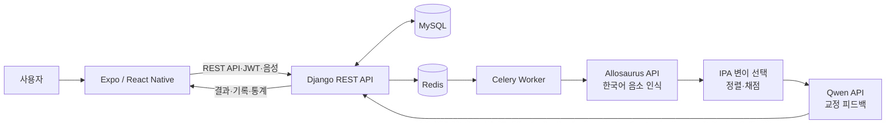
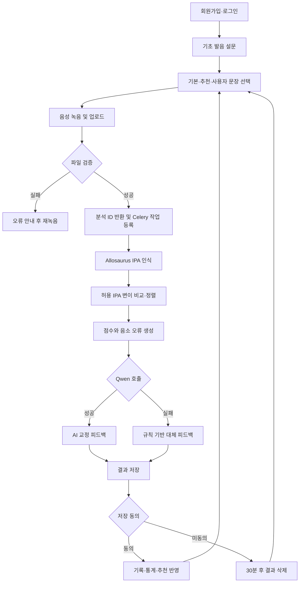

# Jipangi

> 청각장애인의 한국어 발음 연습을 돕는 IPA 기반 AI 발음 교정 서비스

Jipangi는 사용자의 음성을 한국어 음소열로 인식하고 목표 IPA와 비교하여 발음 점수, 오류 위치와 교정 피드백을 제공하는 부산대학교 컴퓨터공학과 졸업과제입니다.

> [!IMPORTANT]
> 본 프로젝트는 연구·교육용 프로토타입이며 의료적 진단이나 언어재활 전문가의 임상적 판단을 대체하지 않습니다.
>
> 산업체 멘토링 기록, 발표 자료·영상 링크, 팀원 정보와 참여 후기는 팀 확인이 필요한 항목으로 표시했습니다. 제출 전 해당 부분을 실제 내용으로 교체해야 합니다.

### 1. 프로젝트 배경

#### 1.1. 국내외 시장 현황 및 문제점

2024년 말 국내 등록장애인은 약 263만 명이며 청각장애는 약 44만 명으로 전체 등록장애인의 16.8%를 차지합니다. 신규 등록장애인 중에서도 청각장애 비중이 가장 크게 나타나, 고령화와 함께 의사소통·재활 지원 수요가 지속될 가능성이 큽니다. 국내 통계는 [한국장애인개발원의 2024년 등록장애인 현황](https://www.koddi.or.kr/webzine/didimdol/vol303/page01-03.html)과 [국회예산정책처 분석 자료](https://www.nabo.go.kr/ko/report/analysisView.do?idx=9010)를 참고했습니다.

세계보건기구는 전 세계에서 약 4억 3천만 명이 장애를 동반한 청력 손실로 재활을 필요로 하며, 2050년에는 그 수가 7억 명을 넘을 것으로 전망합니다. 적절히 대응하지 못한 청력 손실은 교육, 고용과 사회 참여의 제약으로 이어질 수 있습니다. 자세한 수치는 [WHO 청력 손실 현황](https://www.who.int/news-room/fact-sheets/detail/deafness-and-hearing-loss)에서 확인할 수 있습니다.

현재 관련 서비스는 다음과 같은 한계가 있습니다.

- 범용 음성인식기는 표준 발화를 중심으로 학습되므로 비정형 발화나 조음 특성이 있는 음성의 인식률이 낮을 수 있습니다.
- 영어 발음 학습 서비스는 많지만 한국어 발음을 음소 단위로 시각화하고 교정하는 서비스는 상대적으로 부족합니다.
- 비정형 발화 인식 서비스는 의사소통 보조에 초점을 두며, 한국어 발음의 오류 위치와 연습 방법까지 제공하는 경우는 제한적입니다.
- 대면 재활은 전문가의 평가라는 장점이 있지만 시간·거리·비용 제약으로 매일 반복 연습하기 어렵습니다.
- 단순 점수만 제공하면 사용자가 어떤 음소를 어떻게 고쳐야 하는지 이해하기 어렵고, 음성 원본의 보관 여부도 중요한 개인정보 문제입니다.

| 서비스 | 주요 대상과 기능 | Jipangi 관점의 한계 |
| --- | --- | --- |
| [ELSA Speak](https://elsaspeak.com/en/faqs/what-is-elsa-speak) | 영어 학습자를 위한 AI 발음 코치와 실시간 피드백 | 영어 학습 중심이며 한국어 청각장애인의 조음 연습을 목표로 하지 않음 |
| [Google Project Relate](https://sites.research.google/relate/help/) | 비정형 발화를 학습한 개인화 음성인식·자막·음성 재생 | 영어권 성인과 Android 중심이며 현재 신규 가입을 받지 않고, 발음 교정보다 의사소통 보조에 초점 |
| [Voiceitt](https://www.voiceitt.com/) | 언어장애·고령자 등의 비정형 발화를 이해하는 음성 인터페이스 | 현재 영어 중심이며 한국어 음소별 채점과 연습 문장 추천을 제공하지 않음 |
| Jipangi | 한국어 문장 녹음, IPA 인식·정렬, 오류 분석, 반복 연습과 기록 | 연구용 프로토타입으로 임상 검증과 사용자 평가가 추가로 필요 |

#### 1.2. 필요성과 기대효과

Jipangi는 전문가 치료 사이의 일상적인 자가 연습을 보조하는 도구를 목표로 합니다. 사용자는 장소와 시간에 구애받지 않고 문장을 반복해서 녹음하고, 청각 정보 대신 IPA·단어 위치·오류 유형과 같은 시각적 피드백으로 자신의 발음을 확인할 수 있습니다.

기대효과는 다음과 같습니다.

- **접근성 향상:** 모바일·웹에서 반복 연습을 제공하여 지역과 이동 제약을 완화합니다.
- **구체적인 학습:** 문장 전체 점수뿐 아니라 삽입·삭제·치환된 음소와 단어 위치를 보여 줍니다.
- **개인화:** 누적 기록에서 자주 틀리는 음소를 집계하고 다음 연습 문장을 추천합니다.
- **학습 지속성:** 녹음, 분석, 결과 확인과 재연습을 짧은 순환 구조로 제공합니다.
- **연구 기반 확보:** 한국어 34음소 인식 파이프라인과 재현 가능한 실험 설정을 축적합니다.
- **개인정보 최소화:** 분석이 끝나면 원본 음성을 삭제하고, 저장에 동의하지 않은 결과는 30분 뒤 삭제합니다.

### 2. 개발 목표

#### 2.1. 목표 및 세부 내용

최종 목표는 한국어 발음 연습 문장을 선택하거나 직접 입력한 뒤 음성을 녹음하면, 서버가 발음을 음소 단위로 분석하고 이해 가능한 교정 피드백을 돌려주는 통합 서비스를 구현하는 것입니다.

| 세부 목표 | 구현 내용 | 현재 상태 |
| --- | --- | --- |
| 사용자 관리 | 이메일 로그인, JWT 발급·갱신·폐기, 사용자 정보와 기초 발음 설문 | 구현 |
| 연습 콘텐츠 | 카테고리·난이도별 기본 문장, 사용자 정의 문장, 추천 문장 | 구현 |
| 음성 입력 | Expo 녹음, 최대 20MiB 업로드, 형식·길이 검증과 WAV 변환 | 구현 |
| 음소 인식 | KsponSpeech 기반 한국어 34음소 Allosaurus 모델과 내부 HTTP 추론 서비스 | 코드·학습 파이프라인 구현, 가중치는 별도 관리 |
| 발음 평가 | 복수의 허용 IPA 변이와 인식 IPA를 정렬하여 0~100점과 오류 유형 산출 | 구현 |
| 교정 피드백 | Qwen 기반 요약·우선순위·음소별 연습 팁, 장애 시 규칙 기반 대체 피드백 | 구현 |
| 기록·통계 | 분석 이력, 평균 점수, 취약 음소, 추천 문장 조회 | 구현 |
| 개인정보 보호 | 원본 음성 즉시 삭제, 저장 미동의 결과 30분 후 만료 | 구현 |
| 품질 검증 | Django API 테스트, Allosaurus 데이터·학습·평가 회귀 테스트 | 구현 |

#### 2.2. 기존 서비스 대비 차별성

| 비교 항목 | 일반 발음 학습 앱 | 비정형 발화 인식 서비스 | Jipangi |
| --- | --- | --- | --- |
| 주 언어·대상 | 주로 영어 학습자 | 주로 영어권 언어장애 사용자 | 한국어 발음 연습이 필요한 청각장애인 |
| 핵심 목적 | 외국어 유창성·억양 개선 | 발화를 문자나 합성음으로 전달 | 발음 오류 발견, 이해와 반복 교정 |
| 분석 단위 | 단어·문장 점수 중심 | 문장 인식 결과 중심 | IPA 음소, 단어 위치, 오류 유형 |
| 한국어 음운 규칙 | 제한적 | 제한적 | 표준 발음과 허용 발음 변이를 함께 비교 |
| 피드백 | 고정형 또는 영어 학습형 | 의사소통 결과 중심 | 오류 목록을 근거로 한 LLM·규칙 기반 교정 |
| 데이터 관리 | 서비스 정책에 따라 상이 | 개인화 학습용 녹음 필요 가능 | 음성 즉시 삭제, 결과 저장 동의 분리 |
| 모델 투명성 | 상용 폐쇄형이 많음 | 상용·연구 서비스 | 학습 설정, 평가 코드와 모델 버전을 분리 기록 |

핵심 차별점은 “발화를 맞게 받아쓰는 것”보다 “목표 한국어 발음과 어떤 음소가 어떻게 다른지 설명하는 것”에 있습니다. 또한 단일 표준 IPA만 강제하지 않고 한국어에서 허용될 수 있는 발음 변이를 함께 비교하여 불필요한 감점을 줄이도록 설계했습니다.

#### 2.3. 사회적 가치 도입 계획

- **디지털 접근성:** 중요한 정보를 색상만으로 구분하지 않고 텍스트, 아이콘, 점수와 오류 위치를 함께 제공합니다.
- **재활 기회 확대:** 대면 치료를 대체하지 않으면서 치료 외 시간의 반복 연습 수단을 제공합니다.
- **프라이버시:** 음성 원본의 최소 수집·즉시 삭제, 분석 결과 저장 동의와 삭제 기능을 적용합니다.
- **공정성:** 연령, 성별, 장애 정도와 발화 특성별 성능을 따로 측정하고 오인식 사례를 데이터 개선에 반영할 계획입니다.
- **당사자 참여:** 청각장애인, 언어재활사와 보호자를 대상으로 사용성 평가를 실시하고 문장 난이도와 피드백 표현을 개선할 계획입니다.
- **지속 가능성:** 모델 가중치와 대용량 데이터를 코드에서 분리하고, 재현 가능한 설정과 체크포인트 재개 기능으로 불필요한 재학습을 줄입니다.
- **환경적 효과:** 원격 연습은 반복적인 이동 필요를 줄일 가능성이 있으나, 효과를 과장하지 않고 실제 사용 데이터를 통해 검증할 계획입니다.

### 3. 시스템 설계

#### 3.1. 시스템 구성도



- Django는 인증, 문장, 분석 요청과 결과 API를 제공합니다.
- Celery는 음성 분석을 비동기로 실행하고 Redis를 broker와 result backend로 사용합니다.
- Allosaurus 서비스는 WAV를 받아 한국어 IPA 배열을 반환합니다.
- Django는 목표 IPA 변이 중 인식 결과와 가장 가까운 발음을 선택해 오류와 점수를 계산합니다.
- Qwen 서비스는 문장, 목표·인식 IPA, 점수와 오류 목록으로 교정 피드백을 만듭니다.
- Qwen 호출이 실패해도 규칙 기반 피드백으로 음향 분석 결과를 보존합니다.

#### 3.2. 사용 기술

| 구분 | 기술 | 적용 내용 |
| --- | --- | --- |
| Frontend | Expo 53, React 19, React Native 0.79 | Web·Android·iOS 공통 UI, 녹음, 토큰과 분석 상태 관리 |
| Backend | Python, Django 5.2, Django REST Framework 3.16 | REST API, 비즈니스 로직, 관리자 기능 |
| 인증 | SimpleJWT | Access/Refresh 토큰, rotation과 blacklist |
| DB | MySQL 8 | 사용자, 문장, 분석, 오류, 피드백 저장 |
| 비동기 처리 | Redis, Celery 5.5 | 음성 분석 작업과 결과 만료 작업 |
| 음성 처리 | ffmpeg, mutagen, filetype | 업로드 검증, WAV·16kHz·mono 변환 |
| 음소 인식 | Allosaurus, PyTorch 2.5.1 | 한국어 34음소 파인튜닝과 추론 |
| 학습 데이터 | KsponSpeech | 한국어 자유발화 기반 음향 모델 파인튜닝 |
| 발음 변환 | g2pK, IPA 변환 규칙 | 문장의 표준 발음과 허용 변이 생성 |
| 피드백 | Qwen3-8B-AWQ, vLLM | 구조화된 한국어 교정 피드백 생성 |
| API 문서 | OpenAPI 3, drf-spectacular, Swagger UI | 명세 생성과 수동 테스트 |
| 테스트 | Django TestCase, pytest, Postman | API, 모델, 전처리·학습 파이프라인 검증 |
| 실험 관리 | YAML, Weights & Biases | 실험 설정, 지표와 체크포인트 기록 |

### 4. 개발 결과

#### 4.1. 전체 시스템 흐름도



#### 4.2. 기능 설명 및 주요 기능 명세서

API 기본 경로는 `/api/v1`이며 세부 요청·응답은 [API 명세 v2](Jipangi/docs/api-spec-v2.md)와 [OpenAPI 문서](Jipangi/docs/openapi.yaml)를 기준으로 합니다.

| 기능 | 입력 | 처리 | 출력·API |
| --- | --- | --- | --- |
| 회원가입·로그인 | 이메일, 이름, 비밀번호 | 사용자 검증, 비밀번호 해시, JWT 발급 | 토큰·사용자 정보, `POST /auth/signup`, `POST /auth/login` |
| 토큰 갱신·로그아웃 | Refresh Token | 토큰 rotation, 기존 토큰 blacklist | 새 토큰 또는 `204`, `/auth/token/refresh`, `/auth/logout` |
| 기초 발음 설문 | 발음 불편도 응답 또는 건너뜀 | 사용자별 최초 평가 저장 | 평가 상태, `POST /users/me/baseline-assessment` |
| 문장 조회 | 카테고리, 난이도, 페이지 | 활성 기본·사용자 문장 필터링 | 문장 목록·상세, `GET /sentences` |
| 사용자 문장 | 한국어 문장 | 정규화, G2P, IPA·단어 위치·발음 변이 생성 | 생성 문장, `POST /sentences/custom` |
| 생활 문장 전사 | 음성 파일 | Whisper 기반 전사 후 연습 문장 후보 생성 | 전사 텍스트, `POST /lifestyle/transcribe` |
| 분석 요청 | 문장 ID, 음성, 결과 저장 동의 | 파일 검증·임시 저장, Celery 작업 등록 | 분석 UUID와 상태, `POST /analyses` |
| 분석 상태 | 분석 UUID | 현재 작업 상태와 만료 여부 확인 | pending·processing·completed·failed, `GET /analyses/{id}/status` |
| 음소 채점 | 목표 IPA 변이, 인식 IPA | Levenshtein 정렬, 최적 변이 선택, 오류 유형·점수 계산 | 0~100점, 정렬 결과, 오류 목록 |
| 교정 피드백 | 문장, IPA, 점수, 오류 | Qwen 구조화 출력 검증 또는 규칙 기반 대체 | 요약, 상세 설명, 우선 항목, 음소별 팁 |
| 기록·통계 | 인증 사용자, 필터·페이지 | 저장 동의한 결과 집계 | 분석 이력, 평균 점수, 취약 음소, `/records`, `/statistics/summary` |
| 추천 문장 | 사용자 오류 통계 | 취약 음소와 난이도에 맞는 문장 선택 | 추천 목록, `GET /sentences/recommendation` |
| 개인정보 정리 | 처리 완료 음성, 저장 미동의 결과 | 음성 즉시 삭제, Celery ETA로 결과 만료 | 최소 보관 정책 적용 |

#### 4.3. 디렉토리 구조

```text
.
├── Jipangi/
│   ├── frontend/                    # Expo / React Native 클라이언트
│   ├── backend/
│   │   ├── config/                  # Django·Celery·OpenAPI 설정
│   │   ├── users/                   # 인증, 사용자, 기초 설문
│   │   ├── pronunciation/           # 문장, 분석, 오류, 기록·통계
│   │   ├── scripts/                 # 문장 데이터 생성·가져오기
│   │   └── requirements.txt
│   ├── ai_services/                 # Allosaurus 추론 서버와 서비스 실행 예시
│   ├── docs/                        # API 명세, OpenAPI, ERD
│   └── tests/postman/               # 전체 API 통합 테스트
├── allosaurus/
│   ├── allosaurus/                  # 음향 모델·음소 모델·학습 코드
│   ├── configs/                     # 한국어 inventory와 실험 YAML
│   ├── scripts/                     # 데이터 감사·분할·학습·평가
│   ├── test/                        # 파인튜닝 파이프라인 회귀 테스트
│   └── environment.yml
├── report/mid_report/               # 중간보고서 LaTeX 원본
├── GIT_UPLOAD_GUIDE.md              # 비밀정보·모델·데이터 제외 정책
└── README.md
```

모델 가중치, 원본 음성, 전처리 데이터, 가상환경과 실험 산출물은 저장소에 포함하지 않습니다. 세부 기준은 [Git 업로드 제외 정책](GIT_UPLOAD_GUIDE.md)을 참고합니다.

#### 4.4. 산업체 멘토링 의견 및 반영 사항

> **팀 작성 필요:** 저장소에서 검증 가능한 산업체 멘토링 회의록을 찾을 수 없어 내용을 임의로 작성하지 않았습니다. 제출 전 실제 회의록을 근거로 아래 표를 채워야 합니다.

| 일자·회차 | 멘토 의견 | 반영한 내용 | 관련 화면·코드 또는 이슈 | 상태 |
| --- | --- | --- | --- | --- |
| 입력 필요 | 입력 필요 | 입력 필요 | 입력 필요 | 예정·진행·완료 |
| 입력 필요 | 입력 필요 | 입력 필요 | 입력 필요 | 예정·진행·완료 |

작성할 때는 “피드백을 받았다”에서 끝내지 않고, 변경 전 문제·멘토 의견·실제 수정 사항·검증 결과를 한 행에 연결합니다.

### 5. 설치 및 실행 방법

#### 5.1. 설치절차 및 실행 방법

##### 요구사항

- Git
- Python 3.10 이상
- Node.js 20 이상
- MySQL 8
- Redis
- ffmpeg
- 실제 AI 추론 시 CUDA GPU, Allosaurus 체크포인트와 Qwen 모델

##### 저장소 받기

```bash
git clone https://github.com/pnucse-capstone2026/capstone-2026-team-03.git
cd capstone-2026-team-03
```

##### 백엔드 환경 구성

```bash
cd Jipangi
python3 -m venv .venv
.venv/bin/pip install -r backend/requirements.txt
cp backend/.env.example backend/.env
```

`backend/.env`의 `DJANGO_SECRET_KEY`, `JWT_SIGNING_KEY`, MySQL 정보와 허용 Origin을 로컬 환경에 맞게 변경합니다. 실제 비밀값이 있는 `.env`는 커밋하지 않습니다.

macOS Homebrew MySQL 8.4 환경은 다음 스크립트를 사용할 수 있습니다.

```bash
backend/scripts/start_mysql.sh
brew services start redis
```

그 밖의 환경에서는 MySQL과 Redis를 직접 실행하고 `.env`의 호스트·포트를 맞춥니다.

```bash
cd backend
../.venv/bin/python manage.py migrate
../.venv/bin/python manage.py loaddata initial_categories
../.venv/bin/python manage.py loaddata development_sentences
../.venv/bin/python manage.py runserver
```

모델 없이 API 흐름을 확인하려면 `backend/.env`에 다음 값을 사용합니다. 이 분석 결과는 실제 발음 평가가 아닙니다.

```dotenv
PRONUNCIATION_ANALYZER_BACKEND=pronunciation.services.analyzer.development_analyzer
```

Celery worker는 별도 터미널에서 실행합니다.

```bash
cd Jipangi/backend
../.venv/bin/celery -A config worker --loglevel=INFO
```

##### 프런트엔드 실행

```bash
cd Jipangi/frontend
cp .env.example .env
nvm use
npm ci
npm run web
```

실제 휴대전화에서는 `localhost` 대신 개발 PC의 LAN IP를 `EXPO_PUBLIC_API_BASE_URL`에 지정해야 합니다.

##### 실제 Allosaurus·Qwen 추론

모델 가중치는 저장소에 포함되지 않습니다. Allosaurus 학습·평가 방법은 [Allosaurus README](allosaurus/README.md)를 참고하고, 준비된 모델은 다음과 같이 실행할 수 있습니다.

```bash
python Jipangi/ai_services/allosaurus_server.py \
  --host 127.0.0.1 \
  --port 8101 \
  --model-dir /path/to/allosaurus-model \
  --checkpoint /path/to/best-checkpoint.pt \
  --device-id 0
```

Qwen은 OpenAI 호환 API를 제공하도록 실행합니다.

```bash
vllm serve /path/to/Qwen3-8B-AWQ \
  --host 127.0.0.1 \
  --port 8102 \
  --served-model-name jipangi-qwen3-8b-awq
```

| 서비스 | 기본 주소·포트 | 확인 방법 |
| --- | --- | --- |
| Expo Web | `http://127.0.0.1:8081` | 브라우저 |
| Django API | `http://127.0.0.1:8000` | `/api/v1/sentences` |
| Swagger UI | `http://127.0.0.1:8000/api/docs/` | 브라우저 |
| MySQL | `127.0.0.1:3307` | Homebrew 스크립트 기준 |
| Redis | `127.0.0.1:6379` | `redis-cli ping` |
| Allosaurus | `http://127.0.0.1:8101` | `GET /healthz` |
| Qwen | `http://127.0.0.1:8102` | `GET /v1/models` |

##### 테스트

```bash
cd Jipangi/backend
../.venv/bin/python manage.py check
../.venv/bin/python manage.py makemigrations --check --dry-run
../.venv/bin/python manage.py test --settings=config.settings_test
```

```bash
cd allosaurus
conda env create -f environment.yml
conda activate allosaurus-ft
python -m allosaurus.bin.download_model -m uni2005
pytest
```

현재 기준 Django 테스트 39개와 Allosaurus 테스트 37개가 통과합니다. Allosaurus의 일부 테스트에는 Git에서 제외한 `uni2005` 모델이 필요합니다.

#### 5.2. 오류 발생 시 해결 방법

| 증상 | 원인 확인 | 해결 방법 |
| --- | --- | --- |
| `Access denied for user` 또는 DB 연결 실패 | `.env`의 DB 이름·계정·포트, MySQL 실행 상태 | 계정 권한과 `MYSQL_PORT`를 확인하고 마이그레이션 재실행 |
| 분석 상태가 계속 `pending` | Redis 또는 Celery worker 미실행 | `redis-cli ping`과 Celery 로그 확인 후 worker 재시작 |
| `Allosaurus ... 연결할 수 없습니다` | 8101 서비스·모델 경로·체크포인트 누락 | `/healthz` 확인, `--model-dir`와 `--checkpoint` 절대경로 점검 |
| Qwen 연결 실패 | vLLM 미실행 또는 모델 이름 불일치 | `/v1/models`, `QWEN_BASE_URL`, `QWEN_MODEL` 확인; 실패 시 대체 피드백 생성 여부 확인 |
| `ffmpeg` 관련 변환 실패 | ffmpeg 미설치 또는 PATH 누락 | `ffmpeg -version` 확인 후 운영체제 패키지 관리자로 설치 |
| 브라우저 CORS 오류 | 프런트 주소가 허용 목록에 없음 | `DJANGO_CORS_ALLOWED_ORIGINS`에 정확한 scheme·host·port 추가 |
| 휴대전화에서 API 접근 실패 | `127.0.0.1`이 휴대전화 자신을 가리킴 | 같은 네트워크의 개발 PC LAN IP 사용, 방화벽과 Django host 설정 확인 |
| `LookupError: cmudict` | NLTK 사전 미설치 | `python -m nltk.downloader cmudict` 실행 |
| Allosaurus 테스트에서 모델 이름 오류 | `uni2005` 미다운로드 | `python -m allosaurus.bin.download_model -m uni2005` 실행 |
| JWT 서명 키 경고 | 개발용 키가 너무 짧음 | 32바이트 이상의 무작위 `DJANGO_SECRET_KEY`, `JWT_SIGNING_KEY` 사용 |
| Expo 의존성 오류 | Node 버전 또는 lockfile 불일치 | Node 20 이상에서 `npm ci`로 재설치 |

### 6. 소개 자료 및 시연 영상

#### 6.1. 프로젝트 소개 자료

- [중간보고서 LaTeX 원본](report/mid_report/pnu_graduation_midterm_report_template.tex)
- 발표용 PPT/PDF: **링크 입력 필요**
- 최종 포스터 또는 소개 페이지: **링크 입력 필요**

대용량 발표 파일은 저장소에 직접 추가하기보다 학교·팀 공유 드라이브의 공개 링크를 연결하고 접근 권한을 확인합니다.

#### 6.2. 시연 영상

- 시연 영상 URL: **링크 입력 필요**
- 권장 시연 순서: 회원가입 → 기초 설문 → 추천 문장 선택 → 녹음 → 분석 대기 → IPA 오류·점수·피드백 확인 → 기록·통계 확인
- 영상 설명에 실행 환경, 모델 버전, 촬영 날짜와 실제 분석·개발 모드 여부를 함께 표기합니다.

### 7. 팀 구성

#### 7.1. 팀원별 소개 및 역할 분담

> **팀 작성 필요:** 이름과 역할을 확인할 자료가 없어 임의로 작성하지 않았습니다.

| 이름 | 역할 | 주요 담당 | 산출물·관련 경로 |
| --- | --- | --- | --- |
| 입력 필요 | 팀장·기획 등 | 입력 필요 | 입력 필요 |
| 입력 필요 | 프런트엔드 등 | 입력 필요 | 입력 필요 |
| 입력 필요 | 백엔드 등 | 입력 필요 | 입력 필요 |
| 입력 필요 | AI·데이터 등 | 입력 필요 | 입력 필요 |

#### 7.2. 팀원 별 참여 후기

- **팀원 1 — 이름 입력 필요:** 참여 후기 입력 필요
- **팀원 2 — 이름 입력 필요:** 참여 후기 입력 필요
- **팀원 3 — 이름 입력 필요:** 참여 후기 입력 필요
- **팀원 4 — 이름 입력 필요:** 참여 후기 입력 필요

각 후기는 담당 업무, 가장 어려웠던 문제, 해결 과정, 협업에서 배운 점과 향후 개선점을 포함해 3~5문장으로 작성하는 것을 권장합니다.

### 8. 참고 문헌 및 출처

1. World Health Organization, [Deafness and hearing loss](https://www.who.int/news-room/fact-sheets/detail/deafness-and-hearing-loss), 2026.
2. 한국장애인개발원, [2024년 기준 등록장애인 현황 살펴보기](https://www.koddi.or.kr/webzine/didimdol/vol303/page01-03.html), 2025.
3. 국회예산정책처, [장애인 복지시설 운영·지원사업 평가](https://www.nabo.go.kr/ko/report/analysisView.do?idx=9010), 2025.
4. ELSA, [What is ELSA Speak?](https://elsaspeak.com/en/faqs/what-is-elsa-speak).
5. Google Research, [Project Relate Help Center](https://sites.research.google/relate/help/).
6. Voiceitt, [Inclusive Voice AI](https://www.voiceitt.com/).
7. Li, X. et al., [Universal Phone Recognition with a Multilingual Allophone System](https://www.cs.cmu.edu/~awb/papers/2020_Li_ICASSP.pdf), ICASSP 2020.
8. Bang, J.-U. et al., [KsponSpeech: Korean Spontaneous Speech Corpus for Automatic Speech Recognition](https://doi.org/10.3390/app10196936), Applied Sciences, 2020.
9. Allosaurus contributors, [Allosaurus GitHub repository](https://github.com/xinjli/allosaurus).
10. Jipangi 내부 문서: [API 명세](Jipangi/docs/api-spec-v2.md), [OpenAPI](Jipangi/docs/openapi.yaml), [데이터베이스 ERD](Jipangi/docs/database-erd.md), [업로드 제외 정책](GIT_UPLOAD_GUIDE.md).

외부 자료는 2026년 9월 30일에 최종 확인했습니다. `allosaurus/`는 원 프로젝트의 GPL-3.0 라이선스를 따르며, 프로젝트 나머지 코드의 사용·배포 조건은 팀이 별도로 확정해야 합니다.
